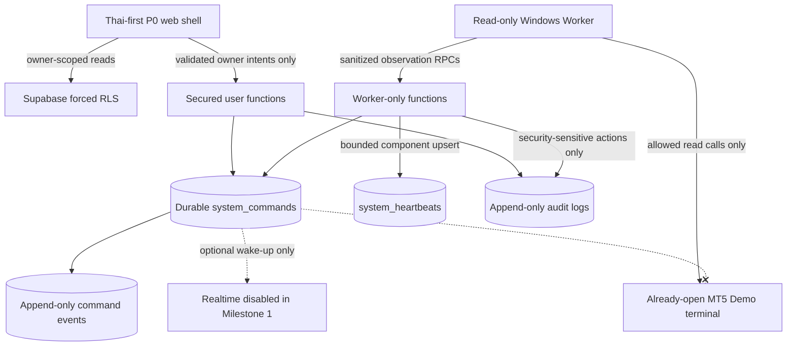

# Aurum Console Architecture

## Scope and invariants

The released **Milestone 2 — Windows MT5 Read-Only Worker and restart/reconnect reconciliation** builds on the Bootstrap and Milestone 1 foundations. Its release status is **COMPLETE WITH DOCUMENTED LIMITATIONS**. The final heartbeat/liveness local gates and Pull Request run `33541088560` passed on 2026-09-02; that run verified `quality`, `database`, and `windows-mt5-boundary` on implementation commit `3e25007`. That foundation observes an already-open Demo terminal, persists sanitized read models, and reconciles broker observations against separately confirmed durable state.

Milestone 3 is **IN PROGRESS — INTEGRATED DEMO/SHADOW CODE; REAL-SOURCE ACCEPTANCE BLOCKED**. The serialized Worker now connects market/features, a research baseline, risk/eligibility, dedicated immutable Shadow records and authenticated owner-scoped pages. Genuine ledger/news/cost/safety providers and hosted configuration remain unresolved alongside native transaction-time readiness. See [implementation and runbook](MILESTONE_3_IMPLEMENTATION.md). No native smoke was rerun and no full real-source pass is established.

The following invariants apply at every boundary:

- Environment is `DEMO_ONLY`.
- The only canonical asset is `XAUUSD` (shown to users as XAU/USD).
- Initial and only enabled runtime mode is `SHADOW`.
- Maximum permitted volume is `0.01`; it is a ceiling, not a default order size.
- At most one Position may be represented as open.
- A Stop Loss is mandatory on every proposal and open-Position shape.
- Live accounts fail closed. There is no Live Trading switch or alternate path.
- Martingale, grid trading, averaging down, loss-based volume increases, and hard-risk overrides are prohibited.
- No broker write, order submission, simulated execution, or MT5 Position mutation exists.

## Workspace map

```text
apps/web                 Next.js App Router static P0 shell and read-only control-plane boundary
apps/worker              Typed Python Worker, MT5 read adapters, market/feature and risk components; no command consumer
packages/contracts       Hand-written Zod contracts plus generated Supabase database types
contract-fixtures        One versioned TS/Python parity corpus
fixtures                 Authoritative 20 presentation-only design scenarios
supabase/migrations      Versioned domain, RLS, grant, and secured-function migrations
supabase/tests           pgTAP constraints, RLS, queue, and database-security tests
supabase/integration-tests
                         Credential-free overlapping-session queue tests inside the isolated database
supabase/seed.sql        Deterministic fictional local-only owner and conservative foundation
docs                     Architecture, database, security, decisions, traceability, and runbooks
scripts                  Quality, local Supabase, generated-type, build, and safety checks
```

The design-reference files under `docs/design-reference/` remain visual and behavioral specifications only. Production code does not import them, `support.js`, or anything under `_ds/`.

## Control-plane flow



The crossed path is deliberate: a database command is control-plane intent, not approval by a Worker, broker confirmation, or execution. No process consumes commands to create a broker side effect in this milestone.

## Web boundary

`apps/web` production routes now use a server-verified Supabase Auth session and a bounded SELECT-only Shadow gateway. Dashboard, UUID decision details and journal validate owner/index/payload agreement, complete event chains and microsecond time bounds. No-data, invalid, disconnected and stale states never substitute fixtures. The health page labels persisted pipeline evidence; Position evidence remains explicitly unavailable. Legacy MT5/heartbeat mappers and design components remain separately tested, not a claim that every legacy diagnostic is deployed. No MT5 control or protected operational browser-write capability exists.

The web control-plane boundary is read-only by construction. Protected writes are not exposed by repository adapters. Authenticated actions, when a later UI connects them, must call the specific intent functions and receive durable command identifiers; browser code cannot insert, update, or delete operational rows. Public browser configuration may never include a Worker or Supabase secret.

The Development State Simulator remains development/test-only. Production forces `no_signal`, ignores manual scenario selection, and scans the bundle for the simulator marker.

## Shared contracts

`packages/contracts` owns intentional cross-boundary Zod models, canonical status arrays, typed command payloads, and row-to-domain mapping rules. It does not treat generated persistence rows as domain objects.

`packages/contracts/src/database.generated.ts` is generated from the local `public` schema. Persistence rows retain snake_case and SQL nullability; domain/wire models use camelCase and deliberate optional-field semantics. Type and test assertions keep database enums aligned with TypeScript, while the versioned JSON corpus is consumed by both Vitest and pytest to keep Zod and Pydantic behavior equivalent.

Numeric PostgreSQL values are authoritative for financial precision. Browser arithmetic requires an explicit conversion/decimal policy rather than silently assuming that a generated `number | string` is safe.

## Worker boundary

`apps/worker` owns an immutable typed read domain, a complete deterministic fake, and one lazy-import Windows native adapter. The native adapter serializes process-global terminal access and exposes only explicit read methods. Decimal values are constructed from native string representations; tickets cross boundaries as strings; all timestamps are UTC-aware.

The database defines a dedicated NOLOGIN `aurum_worker` role for fake local claim tests and a future independently issued credential. Its JWT claim model includes an assigned owner and Worker identifier. It receives only secured Worker-function execution, never broad administrative authority and never a frontend session.

The official `MetaTrader5==5.0.6090` dependency is optional and Windows/Python-3.13-only. Linux imports and gates work without it. The terminal path is the sole positional argument to `initialize()`; credentials and `login()` are outside the boundary. Safety-sensitive native booleans are strict and fail closed.

Polling is cancellable and uses three bounded cadences whose defaults are 5 seconds for tick/connection reads, 15 seconds for Position/active-Order reads, and 600 seconds for full safety reconciliation. The heartbeat TTL defaults to 30 seconds, is bounded to 15–300 seconds, and must be at least three times the configured tick interval. The seeded expected heartbeat interval remains 15 seconds for all three enabled execution components. Startup and reconnect require a successful full reconciliation before health can return to healthy. Only full cycles query bounded Order and Deal histories or create reconciliation rows. Reconnect backoff remains bounded and resets only after a verified cycle.

One poller-owned heartbeat publisher derives all component states so reconciliation and short polling cannot publish contradictory truths:

- `execution.worker` is the authoritative read-only Worker state. A successful full reconciliation may establish Healthy only while the poller is running, the Terminal is connected, `reconciliation_required` is false, and no current fatal Worker failure exists. Degraded full state remains Degraded; blocked or unavailable state maps to Failed. Short polls may renew or lower this state but never promote it.
- `execution.mt5_adapter` represents Terminal/API connectivity and account-read safety. Connected, successfully read, verified bound Demo state is Healthy; verified Demo but unbound is Degraded; disconnected, unavailable, Real, Contest, unknown-mode, account-mismatch, or native-conflict state is Failed.
- `execution.market_data` represents the current tick only: `LIVE → healthy/HEALTHY`, `DELAYED → degraded/TICK_DELAYED`, `STALE → failed/TICK_STALE`, `FUTURE_INVALID → failed/TICK_FROM_FUTURE`, and `UNAVAILABLE → failed/TICK_UNAVAILABLE`.

Full reconciliation renews all three components. A successful tick poll renews all three while preserving the authoritative Worker cap. A Position/active-Order poll renews Worker and MT5 adapter only; it cannot claim current market-data health without a tick. A material Position/Order change sets `reconciliation_required`, which prevents Worker Healthy until a successful full cycle clears it. Adapter/poll failures attempt one bounded Failed publication without recursive persistence retry.

Component Healthy is deliberately narrower than system or trading eligibility. A healthy adapter proves only that the read-only connection boundary is functioning, and healthy market data proves only a live tick. Neither can clear a blocked reconciliation or authorize strategy, risk, approval, command consumption, or broker execution.

Every healthy transition requires Demo verification, a fresh tick, a broker symbol whose native specification is actually base `XAU` and profit `USD`, and a completed reconciliation against an explicit immutable confirmed binding. A discovered or newly observed symbol/fingerprint is evidence only; it cannot confirm itself. Reconciliation can report uncertainty but cannot create execution, close a Position, cancel an Order, or transition a command.

## Supabase boundary

Local Supabase is the Milestone 1 control plane and operational database:

- every exposed application table has enabled and forced RLS;
- unauthenticated access is denied and authenticated reads are owner-scoped;
- direct browser DML on protected state is denied;
- user functions validate one of nine typed intents and apply owner idempotency and optimistic concurrency;
- Worker functions atomically claim with `FOR UPDATE SKIP LOCKED`, return one typed safe-code envelope, clamp leases to command expiry, enforce legal transitions, and append history;
- exact idempotent retries remain stable after mutable resource state changes, while changed content on the same key conflicts;
- recoverable pre-execution leases may be reclaimed, expired or attempt-exhausted pre-execution work is terminalized with event/audit evidence, and `executing` uncertainty is never automatically reclaimed or swept;
- risk policies use immutable versions and bounded conservative rule changes;
- audit and event tables reject application update/delete attempts;
- secured functions use a NOLOGIN owner, pinned empty `search_path`, qualified references, narrow grants, and no dynamic SQL;
- Realtime is disabled and never required for queue correctness.
- six forced-RLS MT5 tables hold sanitized account/specification/latest-tick/reconciliation evidence, including separate per-run Order and Deal history-query evidence;
- seven additional Worker-only functions derive owner and Worker identity from claims, validate exact payloads, and write only those observations;
- the existing heartbeat RPC is replaced additively without changing its signature; it accepts only the three execution component codes, producer states `healthy`/`degraded`/`failed`, and TTL values 15–300 seconds;
- the additive replacement introduces no table, enum, or RPC-signature change; the generated database-type freshness check passed with no shape change;
- `system_heartbeats` remains one owner-scoped versioned row per component under forced RLS; routine renewal appends no audit row, while important incidents and security-sensitive lifecycle actions retain their existing audit behavior;
- authenticated users may read only their own sanitized rows, while neither browser nor Worker receives direct observation DML.

The local CLI is pinned in the lockfile. Docker port publication is verified as loopback-only, and start/status output that can contain local keys is suppressed. The queue concurrency check runs two overlapping, passwordless local `psql` sessions inside the disposable database container. Each session uses the pinned Supabase local role graph to assume the exact `aurum_worker` role without changing role membership; all claimed-row effects roll back and the original state is verified. A failed check destroys the isolated database volume. No remote project, link, push, credential, or production deployment is used.

See [DATABASE_FOUNDATION.md](./DATABASE_FOUNDATION.md) for the table/queue model and [SECURITY.md](./SECURITY.md) for the principal and RLS matrix.

## Responsibility boundaries

The database enforces identity, ownership, immutable versions, bounded financial wire values, expiry, idempotency and ordered outcomes. The M3 Worker validates current market/risk evidence and records dedicated non-executable research cycles; its default external evidence provider returns unavailable. The input digest and independent source receipts retain trace identity, not full ledger replay. Broker margin/profit calls and execution-response handling remain outside the current native allowlist and belong to the later Demo execution milestone.

## Heartbeat patch verification status

Regression coverage includes continuous component renewal, failed/degraded authoritative caps, `reconciliation_required`, all five tick-freshness outcomes, failure propagation, Web missing/expired/invalid handling, Thai labels, bounded tick/heartbeat upserts, RLS, and no routine audit growth. The final local run passed 88 TypeScript tests, 233 Worker tests, 400 pgTAP assertions across nine suites, and four concurrent-claim assertions. Format, lint, type-check, production build, generated types, dependency checks, secret/history scans, runtime-boundary scan, and MT5 AST allowlist also passed. Pull Request run `33541088560` passed `quality`, `database`, and `windows-mt5-boundary` on implementation commit `3e25007`.

## Deferred architecture

The following remain deliberately absent:

- runtime orchestration of market/feature and risk components, the baseline strategy, Shadow proposal production, durable journal/outcomes, and dashboard integration;
- hosted Worker credential issuance and service deployment;
- LINE/LIFF approval, notification delivery, Conditional Auto, and post-execution reconciliation;
- every broker write, execution result, Position mutation, and Order mutation;
- Local Emergency Stop tray/CLI behavior;
- P1 live analysis, AI/ML decisions, P2 analytics, cloud deployment, and all Live Trading capability.

See [Milestone 3 implementation](MILESTONE_3_IMPLEMENTATION.md) for current work and [the roadmap](IMPLEMENTATION_ROADMAP.md) for later authorization gates. Milestone 3 implementation does not authorize approval/command consumption or broker execution, and cannot clear the unresolved [native readiness gate](MILESTONE_3_READINESS.md).
