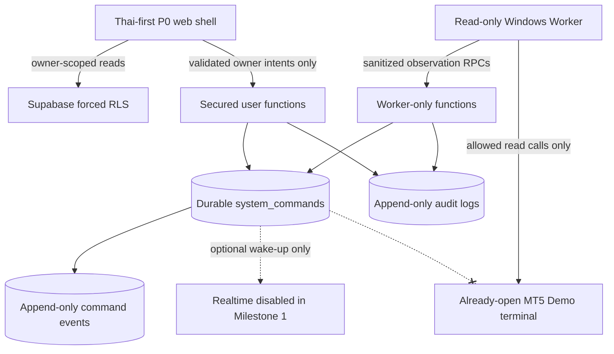

# Aurum Console Milestone 2 Architecture

## Scope and invariants

This repository implements **Milestone 2 — Windows MT5 Read-Only Worker and restart/reconnect reconciliation** on the Bootstrap and Milestone 1 foundations. It observes an already-open Demo terminal, persists only sanitized read models, and reconciles broker observations against durable state. It is still not a strategy, risk, approval, trading, or broker-execution system.

The following invariants apply at every boundary:

- Environment is `DEMO_ONLY`.
- The only canonical asset is `XAUUSD` (shown to users as XAU/USD).
- Initial and only enabled runtime mode is `SHADOW`.
- Maximum permitted volume is `0.01`; it is a ceiling, not a default order size.
- At most one Position may be represented as open.
- A Stop Loss is mandatory on every proposal and open-Position shape.
- Live accounts fail closed. There is no Live Trading switch or alternate path.
- Martingale, grid trading, averaging down, loss-based volume increases, and hard-risk overrides are prohibited.
- No broker write, order submission, simulated execution, or MT5 Position mutation exists.

## Workspace map

```text
apps/web                 Next.js App Router static P0 shell and read-only control-plane boundary
apps/worker              Typed Python Worker with fake and Windows-only MT5 read adapters; no command consumer
packages/contracts       Hand-written Zod contracts plus generated Supabase database types
contract-fixtures        One versioned TS/Python parity corpus
fixtures                 Authoritative 20 presentation-only design scenarios
supabase/migrations      Versioned domain, RLS, grant, and secured-function migrations
supabase/tests           pgTAP constraints, RLS, queue, and database-security tests
supabase/integration-tests
                         Credential-free overlapping-session queue tests inside the isolated database
supabase/seed.sql        Deterministic fictional local-only owner and conservative foundation
docs                     Architecture, database, security, decisions, traceability, and runbooks
scripts                  Quality, local Supabase, generated-type, build, and safety checks
```

The design-reference files under `docs/design-reference/` remain visual and behavioral specifications only. Production code does not import them, `support.js`, or anything under `_ds/`.

## Control-plane flow



The crossed path is deliberate: a database command is control-plane intent, not approval by a Worker, broker confirmation, or execution. No process consumes commands to create a broker side effect in this milestone.

## Web boundary

`apps/web` remains primarily a fixture-driven presentation layer and now has a bounded MT5 observation panel plus an owner-scoped Supabase read adapter for account, symbol, latest tick, reconciliation, mismatch, and safe health projections. Loading, empty, degraded, blocked, stale, reconnecting, pending, and failed states are explicit. No MT5 control or browser write capability exists.

The web control-plane boundary is read-only by construction. Protected writes are not exposed by repository adapters. Authenticated actions, when a later UI connects them, must call the specific intent functions and receive durable command identifiers; browser code cannot insert, update, or delete operational rows. Public browser configuration may never include a Worker or Supabase secret.

The Development State Simulator remains development/test-only. Production forces `no_signal`, ignores manual scenario selection, and scans the bundle for the simulator marker.

## Shared contracts

`packages/contracts` owns intentional cross-boundary Zod models, canonical status arrays, typed command payloads, and row-to-domain mapping rules. It does not treat generated persistence rows as domain objects.

`packages/contracts/src/database.generated.ts` is generated from the local `public` schema. Persistence rows retain snake_case and SQL nullability; domain/wire models use camelCase and deliberate optional-field semantics. Type and test assertions keep database enums aligned with TypeScript, while the versioned JSON corpus is consumed by both Vitest and pytest to keep Zod and Pydantic behavior equivalent.

Numeric PostgreSQL values are authoritative for financial precision. Browser arithmetic requires an explicit conversion/decimal policy rather than silently assuming that a generated `number | string` is safe.

## Worker boundary

`apps/worker` owns an immutable typed read domain, a complete deterministic fake, and one lazy-import Windows native adapter. The native adapter serializes process-global terminal access and exposes only explicit read methods. Decimal values are constructed from native string representations; tickets cross boundaries as strings; all timestamps are UTC-aware.

The database defines a dedicated NOLOGIN `aurum_worker` role for fake local claim tests and a future independently issued credential. Its JWT claim model includes an assigned owner and Worker identifier. It receives only secured Worker-function execution, never broad administrative authority and never a frontend session.

The official `MetaTrader5==5.0.6090` dependency is optional and Windows/Python-3.13-only. Linux imports and gates work without it. Polling is cancellable, reconnect backoff is bounded, and every healthy transition requires Demo verification, a confirmed usable symbol, a fresh tick, and completed reconciliation. Reconciliation can report uncertainty but cannot create execution, close a Position, cancel an Order, or transition a command.

## Supabase boundary

Local Supabase is the Milestone 1 control plane and operational database:

- every exposed application table has enabled and forced RLS;
- unauthenticated access is denied and authenticated reads are owner-scoped;
- direct browser DML on protected state is denied;
- user functions validate one of nine typed intents and apply owner idempotency and optimistic concurrency;
- Worker functions atomically claim with `FOR UPDATE SKIP LOCKED`, return one typed safe-code envelope, clamp leases to command expiry, enforce legal transitions, and append history;
- exact idempotent retries remain stable after mutable resource state changes, while changed content on the same key conflicts;
- recoverable pre-execution leases may be reclaimed, expired or attempt-exhausted pre-execution work is terminalized with event/audit evidence, and `executing` uncertainty is never automatically reclaimed or swept;
- risk policies use immutable versions and bounded conservative rule changes;
- audit and event tables reject application update/delete attempts;
- secured functions use a NOLOGIN owner, pinned empty `search_path`, qualified references, narrow grants, and no dynamic SQL;
- Realtime is disabled and never required for queue correctness.
- five forced-RLS MT5 tables hold sanitized account/specification/latest-tick/reconciliation evidence;
- seven additional Worker-only functions derive owner and Worker identity from claims, validate exact payloads, and write only those observations;
- authenticated users may read only their own sanitized rows, while neither browser nor Worker receives direct observation DML.

The local CLI is pinned in the lockfile. Docker port publication is verified as loopback-only, and start/status output that can contain local keys is suppressed. The queue concurrency check runs two overlapping, passwordless local `psql` sessions inside the disposable database container. Each session uses the pinned Supabase local role graph to assume the exact `aurum_worker` role without changing role membership; all claimed-row effects roll back and the original state is verified. A failed check destroys the isolated database volume. No remote project, link, push, credential, or production deployment is used.

See [DATABASE_FOUNDATION.md](./DATABASE_FOUNDATION.md) for the table/queue model and [SECURITY.md](./SECURITY.md) for the principal and RLS matrix.

## Responsibility boundaries

The database can enforce Demo/XAUUSD identity, volume and Position ceilings, mandatory Stop Loss shape, immutable prohibited-strategy flags, ownership, versions, expiry ordering, idempotency, command state, and leases. It cannot evaluate current spread, market freshness, news, realized loss, drawdown, broker margin, broker response, or reconciliation without future live inputs. Those remain fail-closed responsibilities of later explicitly authorized Risk Engine and Worker milestones.

## Deferred architecture

The following remain deliberately absent:

- market ingestion, feature computation, strategy, deterministic live Risk Engine, and Shadow proposal production;
- hosted Worker credential issuance and service deployment;
- LINE/LIFF approval, notification delivery, Conditional Auto, and post-execution reconciliation;
- every broker write, execution result, Position mutation, and Order mutation;
- Local Emergency Stop tray/CLI behavior;
- P1 live analysis, AI/ML decisions, P2 analytics, cloud deployment, and all Live Trading capability.

See `docs/IMPLEMENTATION_ROADMAP.md` for the authorized milestone order. Completing this milestone does not start Milestone 3.
