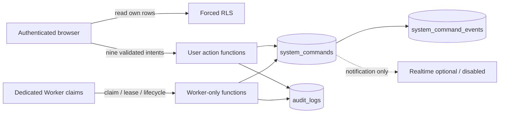
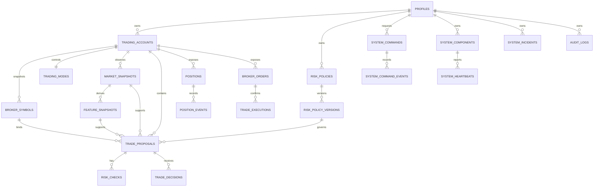
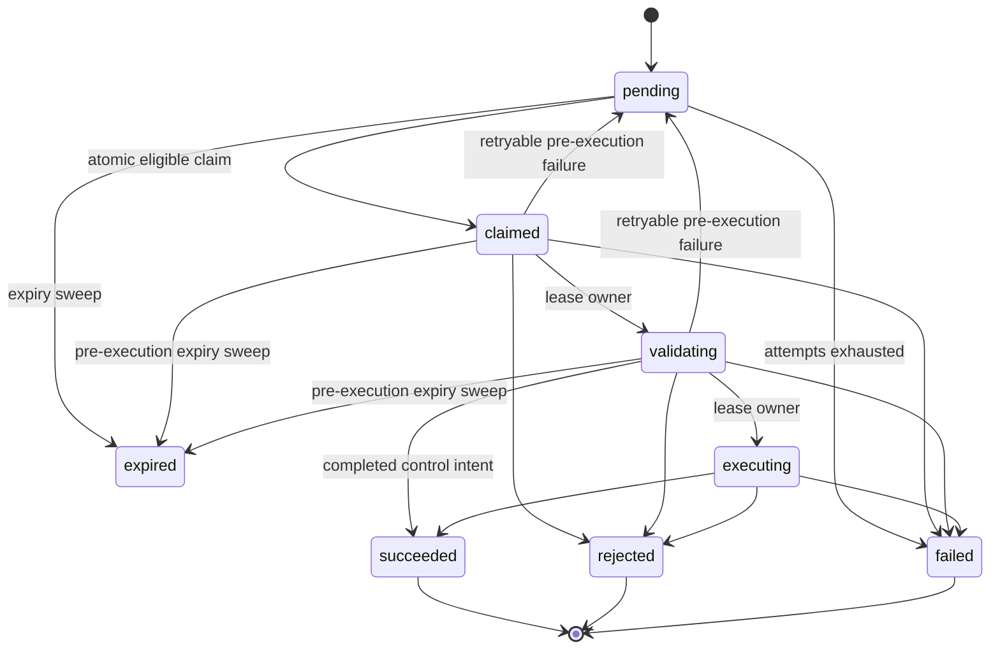

# Supabase Domain Foundation

## Scope

These local migrations establish the Milestone 1 control-plane schema. `broker_orders`, `trade_executions`, and `positions` are protected read-model foundations only. No database action in this milestone creates an order, records a simulated execution, changes a Position, or calls an external system.

All instants are `timestamptz`, all identifiers are UUIDs, and money, prices, percentages, and volume use PostgreSQL `numeric` with explicit finite-value checks. Owner-scoped relationships include `owner_id` in both the child and referenced key; account-bound relationships also carry `trading_account_id` through composite foreign keys.

## Ownership and principal flow



The browser and Worker have no direct DML grant on protected operational tables. Realtime does not participate in transaction correctness or command ownership.

## Table catalog

| Table                   | Purpose                                        | Important integrity rules                                                                                                                                             |
| ----------------------- | ---------------------------------------------- | --------------------------------------------------------------------------------------------------------------------------------------------------------------------- |
| `profiles`              | Auth owner profile                             | ID binds to `auth.users`; owner may update only explicitly granted presentation fields                                                                                |
| `trading_accounts`      | Demo account identity and safety ceiling       | `DEMO_ONLY`, account type `demo`, maximum-permitted-volume value exactly `0.01`, one Position, mandatory Stop Loss                                                    |
| `broker_symbols`        | Immutable broker-symbol specification snapshot | Owner/account binding, `XAUUSD`, positive numeric specification, monotonically positive version                                                                       |
| `trading_modes`         | Owner/account control-plane state              | default and only Milestone 1 mode `SHADOW`; positive resource version                                                                                                 |
| `risk_policies`         | Policy identity and active-version pointer     | active version must belong to the same policy and owner                                                                                                               |
| `risk_policy_versions`  | Immutable conservative policy snapshot         | Demo/XAUUSD, maximum-permitted-volume value exactly `0.01`, one Position, Stop Loss required, prohibited strategy/model flags fixed false, bounded numeric risk rules |
| `market_snapshots`      | Minimal immutable proposal input reference     | Foundation only; no market ingestion is implemented                                                                                                                   |
| `feature_snapshots`     | Minimal immutable proposal input reference     | Owner/account/market provenance binding; no feature or strategy pipeline is implemented                                                                               |
| `trade_proposals`       | Version-bound Shadow proposal record           | Demo/XAUUSD, positive version, same-market feature provenance, spec/policy bindings, expiry after creation, price/volume/Stop Loss checks                             |
| `risk_checks`           | Immutable normalized proposal risk result      | canonical `pass`, `warn`, `fail`, or `na`; unique check key per proposal version                                                                                      |
| `trade_decisions`       | User decision intent record                    | owner/proposal/version binding; created only through secured proposal actions                                                                                         |
| `system_commands`       | Durable intent queue                           | typed payload, owner idempotency, target version, expiry, retry, claim/lease, result, and lifecycle constraints                                                       |
| `system_command_events` | Append-only command history                    | ordered state/event record owned with its command                                                                                                                     |
| `broker_orders`         | Future protected broker-order read model       | Schema only; no Milestone 1 insert or mutation function                                                                                                               |
| `trade_executions`      | Future protected execution read model          | Schema only; no Milestone 1 insert or mutation function                                                                                                               |
| `positions`             | Future protected Position read model           | `XAUUSD`, volume at most `0.01`, mandatory Stop Loss, version/status constraints, at most one active Position per account                                             |
| `position_events`       | Future append-only Position history            | No Milestone 1 producer that changes broker state                                                                                                                     |
| `system_components`     | Registered control/execution-plane component   | Deterministic component code and owner scope                                                                                                                          |
| `system_heartbeats`     | Latest Worker observation per component        | Written only through the Worker heartbeat function; a newer observation updates the same versioned row                                                                |
| `system_incidents`      | Operational incident record                    | Written only through the Worker incident function; safe bounded details and owner/request idempotency                                                                 |
| `audit_logs`            | Security-sensitive action history              | Append-only, bounded safe metadata, no application update/delete grants                                                                                               |

Notifications, mobile approval sessions, user notes, candles, journals, strategy/model runs, and analytics are intentionally absent. They are not required by the current Milestone 1 contracts.

## Domain relationships



## Command creation and idempotency

Each user function derives `owner_id` from `auth.uid()` and builds the canonical camelCase JSON payload. The database validates object type, exact keys, UUID and numeric fields, and command-specific target/version binding before insert.

The owner-scoped idempotency key is trimmed, non-empty, and unique. An exact duplicate returns the existing command deterministically. Reusing the key for different semantic content returns `IDEMPOTENCY_CONFLICT`; it never overwrites the first request. Emergency Stop priority is derived in the database and cannot be lowered by the caller.

After canonical payload validation, the existing owner/key record is checked before a new-request expiry or mutable-resource gate. Consequently, an exact retry still returns `IDEMPOTENT_REPLAY` after the original command, proposal, Position, or policy version changes state. A changed canonical payload or target binding on the same key remains `IDEMPOTENCY_CONFLICT`, while an unused key must pass the current expiry and resource checks.

Proposal and Position functions acquire an owner/resource-scoped transaction advisory lock before comparing the supplied version. The risk-policy function locks the policy row and creates a new immutable version request rather than updating history.

## Queue lifecycle



Claiming first sweeps unexecutable pre-execution rows under row locks. Expired `pending`, `claimed`, or `validating` rows become `expired`; a maximum-attempt `pending` row or an expired maximum-attempt pre-execution lease becomes `failed`. Each sweep transition clears claim ownership and appends a durable event plus audit row. An expired `executing` row is never swept or automatically retried because its future broker outcome could be uncertain.

The eligible claim then uses `FOR UPDATE SKIP LOCKED`, ordered by emergency priority, explicit priority, request time, and identifier. It increments attempts and issues an opaque lease token using the database clock. Two Workers cannot commit ownership of the same row, and a valid lease cannot be stolen. Every new or renewed lease is clamped to `expires_at`, with a database constraint and cross-language contracts enforcing that it cannot cross the absolute command lifetime. `cancelled` remains a reserved terminal state with no exposed Milestone 1 transition.

Each claim call returns exactly one Worker-only typed envelope. Success is `CLAIMED` with the command identity, status, opaque lease, expiry, and version; the safe non-success codes are `NO_ELIGIBLE_COMMAND`, `INVALID_LEASE_DURATION`, and `WORKER_UNAUTHORIZED`, with no payload or raw error detail. Incident recording likewise returns a typed envelope that distinguishes `CREATED`, `IDEMPOTENT_REPLAY`, `IDEMPOTENCY_CONFLICT`, field-specific invalid input, and unauthorized calls. Reusing an owner-scoped incident request ID with identical canonical content returns the existing incident; changed content fails without a new incident or audit row.

Every successful create, claim, transition, or terminal result appends command history and an audit record in the same transaction. A repeated identical terminal completion returns its previous result; a conflicting terminal completion is rejected.

## Risk-policy versioning

The immutable policy snapshot preserves:

- Demo-only environment and `XAUUSD`;
- maximum volume `0.01`, one open Position, and mandatory Stop Loss;
- no martingale, grid trading, averaging down, or loss-based size increase;
- conservative per-trade, daily, weekly, drawdown, trade-count, and minimum Risk/Reward values;
- stale-data, maximum-spread, news-blackout, entry-tolerance, slippage, and sample thresholds;
- no calibrated-model requirement before a model pipeline exists;
- no automatic retry after a broker rejection.

The secured request supports only the canonical bounded numeric rule keys. Immutable safety fields cannot be selected as rule keys. Creating the request and policy version is audited; activation remains protected and cannot be performed by direct frontend update.

## Migration, reset, tests, and generated types

From the project root with Docker running:

```powershell
pnpm db:start
pnpm db:reset
pnpm db:lint
pnpm db:test
pnpm db:types:generate
pnpm db:types:check
pnpm db:stop
```

`pnpm db:check` performs two clean resets, runs schema linting, executes the six pgTAP suites, runs the credential-free two-session concurrent-claim integration, and compares a freshly generated type file with `packages/contracts/src/database.generated.ts`. Generation writes a temporary file first and replaces the committed artifact only after a successful local CLI result.

The concurrent-claim integration is intentionally separate from pgTAP because it must hold one transaction open while a second real database session attempts the same claim. Both sessions connect through the already-running inner database container without a password or remote endpoint. The harness first verifies that the pinned Supabase local `postgres` test identity can `SET ROLE aurum_worker` through the existing role graph; it never grants, revokes, or changes that membership. The first session must receive one `CLAIMED` envelope and hold the row lock; the second must receive one `NO_ELIGIBLE_COMMAND` envelope without a lease or command identity. Both transactions roll back. Verification checks the command plus event/audit counts before cleanup removes the exact fixture and rechecks the baseline SET capability. Any failure triggers fail-closed destruction of the isolated stack and volume.

These commands run the pinned CLI inside a disposable Docker-in-Docker boundary. Only the outer boundary publishes ports, all of them exactly on `127.0.0.1`; the host Docker socket is never mounted. The wrapper verifies pinned image digests, isolated networks, labeled resources, and port mappings before and after commands, suppresses output that can contain local keys, and removes the isolated stack when a command fails.

Never use `supabase login`, `supabase link`, `supabase db push`, `--linked`, or a remote project identifier for this milestone. CLI commands that print local keys are intentionally wrapped and suppressed.
